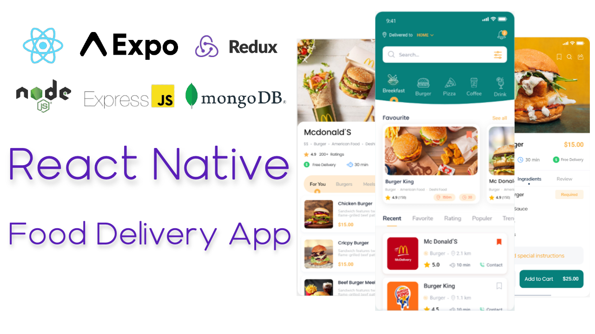

# React Native - Food Delivery App

The Food Delivery App is created using [**React Native**](https://reactnative.dev "Cross Platform Mobile Application Development Framework") with support of few other popular third party libraries like [**React Navigation**](https://reactnavigation.org "For Screen Navigations"), [**Axios**](https://axios-http.com "For HTTP Requests") etc.

## Detailed Tutorial on Youtube

<a href="https://www.youtube.com/playlist?list=PLYnCQ4InLbfeJZ4ET95Jj5_bNepM3a_TT" target="_blank">Click here for full videos</a>

## Icon Libraries

- [Icons8](https://icons8.com "For Icons")
- [Lottie Files (Animated Icons)](https://lottiefiles.com "For Animated Icons")
- [Undraw](https://undraw.co "For illustrations")

## Dependencies

- [React Navigation](https://reactnavigation.org "For Screen Navigations")
  - [Stack Navigator](https://reactnavigation.org/docs/stack-navigator "Stack Navigator")
  - [Bottom Tab Navigator](https://reactnavigation.org/docs/bottom-tab-navigator "Bottom Tab Navigator")
- [React Native Vector Icons](https://github.com/oblador/react-native-vector-icons "Popular React Native Icon Library")
- [Lottie React Native](https://github.com/lottie-react-native/lottie-react-native "For Animated Icons")
- [Axios](https://axios-http.com "For HTTP Requests")
- [React Native Async Storage](https://react-native-async-storage.github.io/async-storage "For Local Storage")
- [Redux](https://redux.js.org "For State Management")
- [React Redux](https://react-redux.js.org "For State Management in React")
- [Redux Thunk](https://github.com/reduxjs/redux-thunk "Redux Thunk for Async State Management")
- [React Native Maps](https://github.com/react-native-maps/react-native-maps "For Maps")

## UI Design

[**Food Door App** by _Ahmed El-okle_](https://www.behance.net/gallery/104564545/Food-Door-app?tracking_source=search_projects_recommended%7Cfood%20delivery%20mobile%20app)

## Setup instructions

### 1. Clone Repository

```sh
# Clone the app
git clone https://github.com/ameenfarook/food_delivery_app.git

# switch branch for specific episode/part like below
git clone https://github.com/ameenfarook/food_delivery_app.git -b part-22
```

### 2. Install all dependencies

```sh
# navigate to app directory
cd food_delivery_app

npm install
```
